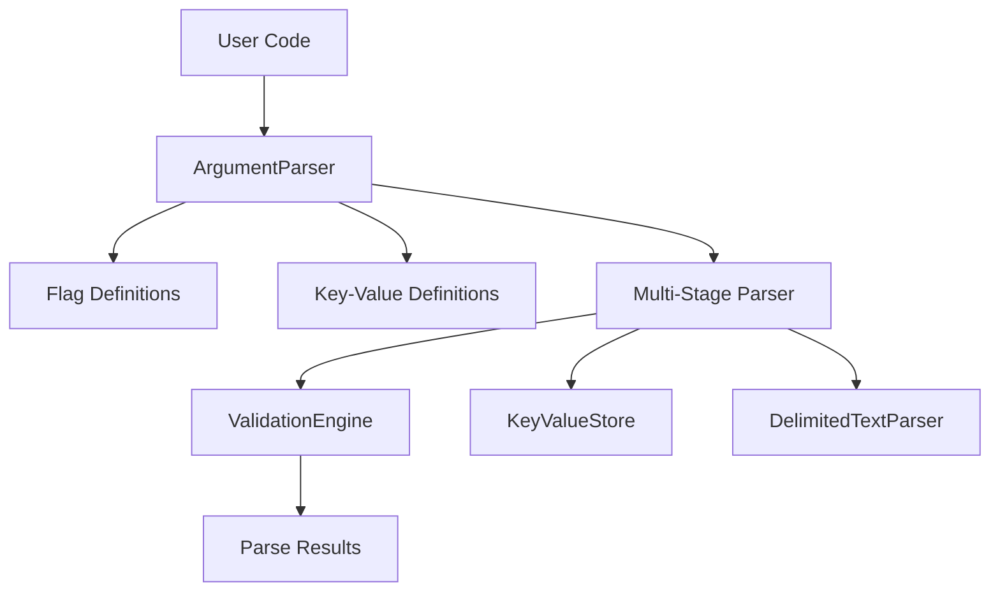
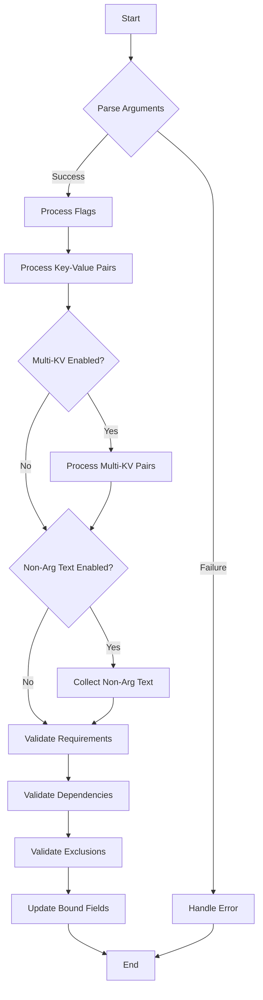

# Architecture and Technical Design

## Introduction

Welcome to the **Design** documentation of the `pam-args` library. This section delves into the architectural framework and internal mechanisms that underpin the library's functionality. By exploring the design principles, module interactions, and data flow, you'll gain a comprehensive understanding of how `pam-args` efficiently parses and manages command-line arguments within PAM modules. This document covers the multi-stage parsing process, the trait-based approach for key-value storage, and the strategies employed to ensure flexibility, scalability, and robustness. Additionally, it discusses the decision-making process behind supporting various argument types, handling dependencies and exclusions, and implementing default values. Whether you're looking to extend the library, troubleshoot its behavior, or simply appreciate its structural integrity, the **Design** documentation provides the insights needed to navigate and comprehend the inner workings of `pam-args`.

## Core Architecture

### Key Components

The `pam-args` library is structured around several key components that work together to provide a comprehensive argument parsing solution:

1. **ArgumentParser**: The main entry point for users of the library, responsible for configuring and executing the parsing process.
2. **Flag and KeyValue Definitions**: Type-safe representations of command-line arguments.
3. **KeyValueStore**: A trait-based approach to storing and retrieving key-value pairs.
4. **ValidationEngine**: Handles dependency checks, required arguments, and allowed values.
5. **DelimitedTextParser**: Manages quoted and bracketed text parsing.

### Component Interactions



## Under The Hood: A Multi-Stage Parser

Under the hood, `pam-args` is a multi-stage parser that processes command-line arguments in the following sequential steps:

1. **Argument Grouping:** Identifies and groups arguments considering both argument and text delimiters (brackets and quotes), while checking for unclosed delimiters.
2. **Explicit Flags Identification:** Determines which argument groups are explicit flags defined in the options array.
3. **Explicit Key-Value Pairs Identification:** Identifies explicit key-value pairs defined in the options array and validates their values and types. Checks variable type, allowed values, and allowed key-value pair types.
4. **Multi Key-Value Pairs Parsing:** If enabled, parses remaining argument groups as multi key-value pairs, validating their formats. Checks allowed key-value pair types.
5. **Non-Argument Text Collection:** If enabled, collects any leftover argument groups as non-argument text. If not enabled and there are any leftover argument groups, an error is returned.
6. **Validation:** Validates required arguments, dependencies, exclusions, and allowed values.
7. **Usage:** The user processes the arguments using the options, non-arguments text, and the key-value store.
8. **Cleanup:** In Rust, cleanup is automatic due to the ownership system. Resources are freed when they go out of scope.

**Notes:**

- **Modular Steps:** The parser is modular, with each parsing step clearly separated into its own function. This makes it easy to follow, debug, and maintain.
- **Debugging and Logging:** Integration with the standard Rust `log` crate allows for detailed debugging at various log levels.
- **Parser Configuration:** The behavior of the parser (e.g., whether it's case-sensitive, whether multi key-value pairs are parsed, whether non-argument text is collected) is fully customizable via the builder pattern with methods like `case_sensitive()`, `enable_multi_key_value()`, and `collect_non_argument_text()`.

### Key Parser Implementation Details

The parser implementation employs several advanced techniques to ensure robustness and performance:

#### State Machine for Delimiter Handling

The parser uses a state machine approach to handle delimiters efficiently:

```rust
enum ParserState {
    Normal,
    InSingleQuote,
    InDoubleQuote,
    InBracket,
    EscapeSequence,
}
```

This allows the parser to track context correctly while processing escape sequences and nested delimiters, ensuring accurate parsing with minimal overhead.

#### Efficient Type Conversion

Type conversion for key-value pairs uses Rust's trait system:

```rust
// Implementation example for type conversion
fn convert_value<T: FromStr>(&self, value: &str) -> Result<T, Error> {
    value.parse::<T>().map_err(|_| {
        match std::any::type_name::<T>() {
            "i32" => Error::InvalidIntValue(value.to_string()),
            "bool" => Error::InvalidBoolValue(value.to_string()),
            _ => Error::InvalidInput(format!("Failed to convert '{}' to {}", 
                                             value, std::any::type_name::<T>()))
        }
    })
}
```

This approach ensures type safety while providing clear error messages that help users diagnose parsing issues.

## KeyValueStore Implementation

### Standard Library vs Custom Implementation

For the key-value store component, the library uses Rust's standard collection types rather than implementing a custom solution. This leverages Rust's battle-tested collections while maintaining compatibility with the original API semantics:

```rust
// Using HashMap with Option<String> to represent the three key-value states
pub struct KeyValueStore {
    store: HashMap<String, Option<String>>,
    case_sensitive: bool,
}

impl KeyValueStore {
    pub fn new(case_sensitive: bool) -> Self {
        Self {
            store: HashMap::new(),
            case_sensitive,
        }
    }
    
    pub fn add(&mut self, key: &str, value: Option<&str>) {
        let key = if self.case_sensitive {
            key.to_string()
        } else {
            key.to_lowercase()
        };
        
        self.store.insert(key, value.map(String::from));
    }
    
    pub fn get(&self, key: &str) -> Option<&str> {
        let lookup_key = if self.case_sensitive {
            key.to_string()
        } else {
            key.to_lowercase()
        };
        
        self.store.get(&lookup_key).and_then(|opt| opt.as_deref())
    }
    
    pub fn has_key(&self, key: &str) -> bool {
        let lookup_key = if self.case_sensitive {
            key.to_string()
        } else {
            key.to_lowercase()
        };
        
        self.store.contains_key(&lookup_key)
    }
    
    pub fn keys(&self) -> Vec<&str> {
        self.store.keys().map(|s| s.as_str()).collect()
    }
}
```

This implementation:
- Uses `HashMap` for efficient key lookup
- Represents the three states from the C library (KEY_ONLY, KEY_EQUALS, KEY_VALUE) using `Option<String>`
- Handles case sensitivity appropriately
- Provides a clean and idiomatic API

Benefits of using standard library collections:
- Performance: Rust's `HashMap` is highly optimized
- Memory safety: Automatic memory management through Rust's ownership system
- Correctness: Well-tested implementation reduces the chance of bugs
- Maintainability: Less custom code to maintain

### Trait-Based Abstraction

The library defines a `KeyValueStore` trait to allow for potential alternative implementations:

```rust
pub trait KeyValueStore {
    fn add(&mut self, key: &str, value: Option<&str>);
    fn get(&self, key: &str) -> Option<&str>;
    fn has_key(&self, key: &str) -> bool;
    fn keys(&self) -> Vec<&str>;
}
```

This trait-based approach provides:
- Flexibility: Different implementations can be swapped in as needed
- Testability: Mock implementations can be created for testing
- Extensibility: New implementations can be added without changing client code

## Direct Field Binding Mechanism

One of the library's most powerful features is direct field binding, which allows argument values to be bound directly to user-defined variables. Here's how it works internally:

### Type-Safe References

The binding mechanism uses Rust's reference system to safely modify user variables:

```rust
// Internal representation for field binding
enum Binding<T> {
    None,
    Field(&'static mut T),
    Callback(Box<dyn Fn(T) + Send + Sync>),
}

impl<T: 'static> Flag {
    pub fn bind_to(mut self, field: &mut bool) -> Self {
        // Store a static reference to the field
        let static_ref: &'static mut bool = unsafe {
            // Safe because the ArgumentParser ensures the reference 
            // remains valid for the lifetime of the binding
            std::mem::transmute::<&mut bool, &'static mut bool>(field)
        };
        self.binding = Binding::Field(static_ref);
        self
    }
}
```

### Safety Considerations

While the binding mechanism uses `unsafe` code, it's carefully constrained:

1. The static reference is only used within the lifetime of the ArgumentParser
2. The binding is consumed during parsing, ensuring no dangling references
3. All mutations happen during the parse call, minimizing the scope of potential issues

### Supporting Different Field Types

For KeyValue arguments, the binding system uses Rust's type system to handle different field types:

```rust
impl<T: 'static + FromStr> KeyValue {
    pub fn bind_to(mut self, field: &mut T) -> Self {
        let static_ref: &'static mut T = unsafe {
            std::mem::transmute::<&mut T, &'static mut T>(field)
        };
        self.binding = Some(Binding::Field(static_ref));
        self
    }
    
    pub fn bind_to_option(mut self, field: &mut Option<T>) -> Self {
        let static_ref: &'static mut Option<T> = unsafe {
            std::mem::transmute::<&mut Option<T>, &'static mut Option<T>>(field)
        };
        self.option_binding = Some(OptionBinding::Field(static_ref));
        self
    }
}
```

This allows for binding to both required and optional fields with appropriate type safety.

## Parsing Flow Diagram



## Error Handling Architecture

The error handling system in `pam-args` is designed around Rust's `Result` type and a custom `Error` enum that provides detailed information about parsing failures.

### Error Design Principles

1. **Specific Error Types**: Each error variant contains specific information about what went wrong
2. **Contextual Information**: Errors include details like argument names to help diagnose issues
3. **No Loss of Information**: Errors preserve all relevant details from the parsing process
4. **User-Friendly Messages**: Error messages are clear and actionable

### Error Implementation

```rust
#[derive(Debug, Clone, PartialEq)]
pub enum Error {
    RequiredArgMissing(String),           // Includes the name of the missing argument
    MutuallyExclusiveArgs(String, String), // Includes both conflicting argument names
    InvalidKeyValue(String),              // Includes the problematic key-value string
    UnrecognizedArg(String),              // Includes the unrecognized argument
    InvalidIntValue(String),              // Includes the invalid integer string
    InvalidBoolValue(String),             // Includes the invalid boolean string
    DependencyNotMet(String, String),     // Includes the argument and its dependency
    InvalidValue(String, String),         // Includes the argument and its invalid value
    DuplicateArgName(String),             // Includes the duplicated argument name
    UnclosedDelimiter(String),            // Includes information about the unclosed delimiter
    NestedBrackets(String),               // Includes information about the nested brackets
    InvalidInput(String),                 // Includes a description of the invalid input
    UnexpectedError(String),              // For truly unexpected errors
}

impl std::error::Error for Error {}

impl std::fmt::Display for Error {
    fn fmt(&self, f: &mut std::fmt::Formatter<'_>) -> std::fmt::Result {
        match self {
            Error::RequiredArgMissing(arg) => 
                write!(f, "Required argument missing: {}", arg),
            Error::MutuallyExclusiveArgs(arg1, arg2) => 
                write!(f, "Mutually exclusive arguments found: {} and {}", arg1, arg2),
            // Other variants...
        }
    }
}
```

### Error Propagation

Errors are propagated through the parsing process using Rust's `?` operator, which provides clean, concise error handling:

```rust
fn parse_and_validate(&self, args: impl IntoIterator<Item = impl AsRef<str>>) -> Result<ParseResult, Error> {
    let grouped_args = self.group_arguments(args)?;
    
    // Process explicit flags
    let (flags, remaining) = self.process_flags(grouped_args)?;
    
    // Process explicit key-value pairs
    let (kv_pairs, remaining) = self.process_key_value_pairs(remaining)?;
    
    // Additional processing and validation...
    
    self.validate_required_args(&result)?;
    self.validate_dependencies(&result)?;
    self.validate_exclusions(&result)?;
    
    Ok(result)
}
```

## Thread Safety Considerations

The `pam-args` library is designed with thread safety in mind, making it usable in multi-threaded environments when needed.

### Thread-Safe Design Principles

1. **Immutable Parsing**: Once configured, the ArgumentParser is immutable during parsing
2. **No Global State**: All state is contained within the parser instance
3. **Send + Sync Traits**: Public types implement Send and Sync where appropriate
4. **Thread-Local Storage**: When mutable state is needed, it's contained within the thread

### Implementation Details

```rust
// Example of ensuring thread safety for parser configuration
pub struct ArgumentParser {
    flags: Vec<Flag>,
    key_values: Vec<KeyValue>,
    case_sensitive: bool,
    enable_multi_kv: bool,
    collect_non_arg_text: bool,
    multi_kv_formats: Vec<AllowedKeyValueFormats>,
    conflict_pairs: Vec<(String, String)>,
}

// Implement Send + Sync traits
unsafe impl Send for ArgumentParser {}
unsafe impl Sync for ArgumentParser {}
```

### Concurrency Patterns

For users who need concurrent parsing, the library supports several patterns:

1. **Arc Sharing**: Using `Arc<ArgumentParser>` to share a parser across threads
2. **Clone-Per-Thread**: Cloning the parser configuration for each thread
3. **Builder Pattern**: Using `ArgumentParserBuilder` to create similar parsers

## Memory Management and Performance

### Zero-Cost Abstractions

The library leverages Rust's zero-cost abstractions to provide high-level functionality without runtime overhead:

1. **Generic Trait Bounds**: Using generics and trait bounds for type safety without runtime costs
2. **Inline Functions**: Critical path functions are marked for inlining
3. **Static Dispatch**: Preferring static dispatch over dynamic dispatch where possible

### Memory Efficiency

Several techniques are used to minimize memory usage:

1. **String Borrowing**: Using string slices (`&str`) instead of owned strings where possible
2. **Preallocated Vectors**: Preallocating vectors to the expected size
3. **Reuse of Allocations**: Reusing allocations for multiple parsing operations

### Performance Considerations

Key performance optimizations include:

1. **HashMaps for Lookup**: Using HashMaps for O(1) argument lookup
2. **Single-Pass Parsing**: Processing arguments in a single pass where possible
3. **Early Returns**: Returning errors early to avoid unnecessary work
4. **Minimized Cloning**: Avoiding unnecessary string cloning

## Workflow

1. **Initialization:** Define user structure and argument definitions.
2. **Parsing:** Process each argument and assign values.
3. **Validation:** Ensure all criteria are met.
4. **Usage:** Access parsed arguments in the PAM module.
5. **Cleanup:** Automatic through Rust's ownership system.

## Design Considerations

- **Flexibility:** Supports various argument and value types.
- **Robustness:** Comprehensive validation and error handling.
- **Usability:** Automatic memory management through Rust's ownership.
- **Maintainability:** Modular design for easier updates and extensions.

## Conclusion

The `pam-args` library's design emphasizes type safety, memory safety, and ergonomics while maintaining compatibility with PAM module requirements. By leveraging Rust's powerful type system and ownership model, it provides a robust and flexible solution for command-line argument parsing in PAM modules. The multi-stage parsing approach, combined with comprehensive validation and error handling, ensures that users can confidently parse and process complex argument patterns with minimal risk of errors.